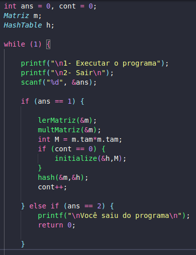
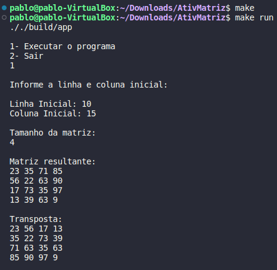
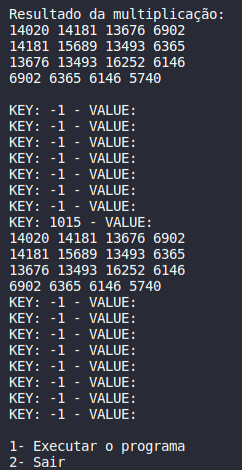

# Trabalho de Aquecimento: Processamento de matrizes por segmentação de arquivo

<h2> Problema </h2>

Neste trabalho, cada aluno deve implementar um sistema de multiplicação de matrizes baseando-se em uma est ratégia de segmentação em arquivo. Um arquivo M grande é fornecido no formato NxN com valores de ponto flutuante ou inteiros como entrada. Este é processado a partir de várias coordenadas introduzidas por um segundo arquivo, o coordenadas.txt. Em coordenadas.txt deve ser descrito por linha uma dupla de i e j correspondendo a posição inicial e final a ser lida. Por exemplo, as posições 2,4,6,10 indica que a leitura em M deve iniciar na linha 2 coluna 4 e seguir até a linha 6 coluna 10. 

Feito a leitura da composição de M para um tipo matriz em C, a segunda etapa é produzir a transposta de M -= MT. Feito isso, produza a multiplicação e armazene em uma hash o resultado da multiplicação como valor para a dupla de i's e j's, os quais deverão ser utilizados como chaves da hash. Assim, para cada novo calculo, antes o sistema deve consular a hash para identificar se a multiplicação já foi realizada. Em caso afirmativo, retorne apenas a resposta já calculada. Caso contrário, elabore a multiplicação e armazene o conteúdo em cache. 

<h2>Resolução</h2>

A resolução deste problema deu-se por meio de alguns métodos para auxiliar na solução. Estes métodos são: <i>lerMatriz()</i>, <i>multMatriz()</i>, <i>initialize()</i> e <i>hash()</i>.

Primeiramente, em <i>lerMatriz()</i>, o programa entra dentro de um loop para entrada do usuário onde deve informar as opções 1 ou 2 como resposta. Caso informe a opção 1, a aplicação lerá uma matriz 1000x1000 de números naturais dentro de um arquivo e armazená-lo em uma matriz do mesmo tamanho.

Em seguida, em <i>multMatriz()</i>, é pedido ao usuário para informar a linha e coluna inicial por onde o programa deve começar a ler a matriz e também o tamanho, que será a quantidade de linhas e colunas que a matriz terá (sempre será uma matriz quadrada). Logo em seguida é mostrado no console a matriz gerada, sua respectiva matriz transposta e a matriz resultante da multiplicação das duas matrizes anteriores.

Já em relação ao método <i>initialize()</i>, ele é chamado somente uma vez para que a Hash não seja deletada e iniciada a cada execução, por isso o motivo da variável <i>cont</i>.

Por último, o método <i>hash()</i>, é responsável por configurar a lógica das chaves da Hash e chamar o método <i>insert()</i> para adicionar a matriz na Hash. A lógica das chaves se dá pelo valor da linha multiplicado por 100 mais o valor da coluna. Por exemplo: se o valor da coluna for 45 e a coluna for 13 a chave será (45x100)+13 = 4513. 

    

 

<h2>Exemplo de Execução</h2>

    

 

    

 

<h2>Compilação e Execução</h2>

O progama disponibilizado possui um arquivo Makefile que realiza todo o procedimento de compilação e execução. Para tanto, temos as seguintes diretrizes de execução:

| Comando                |  Função                                                                                           |                     
| -----------------------| ------------------------------------------------------------------------------------------------- |
|  `make clean`          | Apaga a última compilação realizada contida na pasta build                                        |
|  `make`                | Executa a compilação do programa utilizando o gcc, e o resultado vai para a pasta build           |
|  `make run`            | Executa o programa da pasta build após a realização da compilação                                 |
